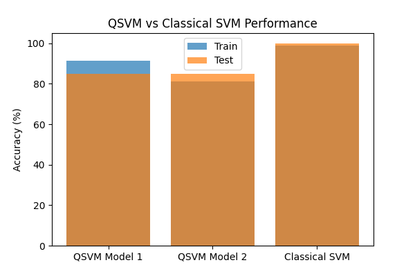

# QSVM QOSF Task 4 — Quantum Support Vector Machine on the Iris Dataset

Implementation and evaluation of **Quantum Support Vector Machines (QSVMs)** on a binary classification problem, comparing two quantum feature-map architectures against a classical SVM baseline. Built for the **QOSF Mentorship Program — Screening Task 4 (QSVM)**.

---

## Table of Contents
- [QSVM QOSF Task 4 — Quantum Support Vector Machine on the Iris Dataset](#qsvm-qosf-task-4--quantum-support-vector-machine-on-the-iris-dataset)
  - [Table of Contents](#table-of-contents)
  - [Overview](#overview)
  - [Project Structure](#project-structure)
  - [Setup](#setup)
  - [Methodology](#methodology)
    - [1. Data Preparation](#1-data-preparation)
    - [2. Classical Baseline](#2-classical-baseline)
    - [3. Quantum Models](#3-quantum-models)
  - [Results](#results)
    - [Accuracy Comparison](#accuracy-comparison)
    - [Figures](#figures)
  - [Discussion](#discussion)
  - [References](#references)

---

## Overview

The task explores whether quantum kernel methods offer an advantage over classical SVMs on a simple, well-separated dataset, and how quantum circuit design (shallow vs. deep, entanglement structure) affects classification performance and decision boundaries.

Two binary-classified Iris classes — **Setosa** and **Versicolor** — are used as the dataset, restricted to two features for direct 2D visualization of decision boundaries.

---

## Project Structure

```
QSVM_QOSF_Task4/
├── README.md
├── requirements.txt
├── notebooks/
│   └── qsvm_task4.ipynb          # Main notebook: pipeline, figures, discussion
├── src/
│   └── qsvm_task4/
│       ├── __init__.py
│       ├── data_preprocessing.py # Loading, normalization, train/test split
│       ├── qsvm_models.py        # Quantum feature maps, QSVM training/eval, classical baseline
│       └── utils.py              # Decision boundary & performance plotting
├── figures/
│   ├── iris_distribution.png
│   ├── qsvm1_train_fast.png
│   ├── qsvm1_test_fast.png
│   ├── qsvm2_train_fast.png
│   ├── qsvm2_test_fast.png
│   └── performance_comparison.png
└── kernel_cache/
    ├── grid_kernel_1.npy          # Cached fidelity kernel, QSVM Model 1
    └── grid_kernel_2.npy          # Cached fidelity kernel, QSVM Model 2
```

> Quantum kernel evaluation is the most expensive step in this pipeline. `kernel_cache/` stores precomputed kernel matrices so the notebook can be re-run without recomputing them from scratch — see `qsvm_models.py` for the caching logic.

---

## Setup

Requires **Python 3.11+**.

```bash
git clone https://github.com/<your-username>/QSVM_QOSF_Task4.git
cd QSVM_QOSF_Task4
pip install -r requirements.txt
jupyter notebook notebooks/qsvm_task4.ipynb
```

**`requirements.txt`:**
```
qiskit
qiskit-machine-learning
scikit-learn
numpy
pandas
matplotlib
```

---

## Methodology

### 1. Data Preparation
- Selected two linearly-related classes from Iris: **Setosa** and **Versicolor**.
- Standardized features with `StandardScaler`.
- Split into 80% train / 20% test (stratified).

### 2. Classical Baseline
- Trained a linear `SVC` on the same standardized features.
- Used as the performance reference point for the quantum models.

### 3. Quantum Models

**QSVM Model 1 — Shallow RY + CX**
A 2-qubit circuit using `RY` rotations for encoding, with a single `CX` entangling layer followed by a repeated `RY` layer. Shallow and robust — well suited to data that's already close to linearly separable.

**QSVM Model 2 — Layered RZ + RY + CX**
A deeper 2-qubit circuit combining `RY` and `RZ` rotations with a two-directional `CX` entangling structure. More expressive, at some cost to training accuracy on a small, simple dataset.

Both circuits are used as feature maps for a `FidelityQuantumKernel`, which produces the kernel matrix passed to an `SVC(kernel="precomputed")`.

---

## Results

### Accuracy Comparison

| Model          | Train Accuracy | Test Accuracy |
|----------------|:---:|:---:|
| QSVM Model 1   | 91.25% | 85.0% |
| QSVM Model 2   | 81.25% | 85.0% |
| Classical SVM  | 98.75% | 100.0% |



### Figures

| Figure | Description |
|---|---|
| `iris_distribution.png` | Scatter plot of the two Iris classes on the selected features |
| `qsvm1_train_fast.png` | QSVM Model 1 decision boundary — training set |
| `qsvm1_test_fast.png` | QSVM Model 1 decision boundary — test set |
| `qsvm2_train_fast.png` | QSVM Model 2 decision boundary — training set |
| `qsvm2_test_fast.png` | QSVM Model 2 decision boundary — test set |
| `performance_comparison.png` | Train/test accuracy across all three models |

---

## Discussion

The classical SVM outperforms both QSVMs on this dataset, which is expected given the setup:

- The **Setosa vs. Versicolor** subset is small and close to linearly separable, so a linear classical kernel already captures the structure well — there's little room for a nonlinear quantum kernel to add value.
- **QSVM Model 1** (shallow) generalizes better than Model 2 despite lower expressiveness, since the extra entanglement in Model 2 doesn't help on data this simple and instead makes optimization slightly less stable, reflected in its lower train accuracy.
- Both QSVMs still reach 85% test accuracy, showing the fidelity kernel approach is functioning correctly — the gap to the classical baseline is a property of the dataset's simplicity, not a flaw in the quantum pipeline.

**Takeaway:** this task illustrates a common and expected result in early QML exploration — quantum kernels are not guaranteed to outperform classical ones on simple, low-dimensional, near-linearly-separable data. Their potential advantage is expected to show up on higher-dimensional or genuinely nonlinearly-structured data, where classical kernels struggle more. This dataset serves as a controlled baseline to validate that the QSVM pipeline (feature map → fidelity kernel → precomputed-kernel SVM) is implemented correctly before scaling to harder problems.

---

## References

- [Qiskit Machine Learning Documentation](https://qiskit.org/documentation/machine-learning/)
- [Iris Dataset — scikit-learn](https://scikit-learn.org/stable/auto_examples/datasets/plot_iris_dataset.html)
- [QOSF Mentorship Program](https://qosf.org/qc_mentorship/)
